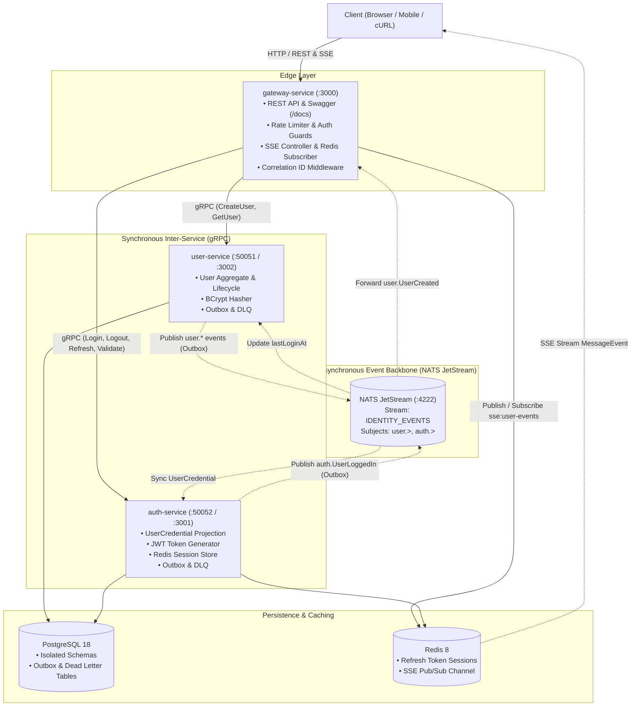

# NestJS E-Commerce Microservices — Production Reference Benchmark

[](https://nestjs.com/)
[](https://www.typescriptlang.org/)
[](https://www.postgresql.org/)
[](https://nats.io/)
[](https://redis.io/)
[](https://grpc.io/)
[-2C8EBB?style=flat&logo=yarn&logoColor=white)](https://yarnpkg.com/)
[](LICENSE)

A production-grade **research and reference benchmark** for designing enterprise distributed systems using a **NestJS monorepo**. This project showcases modern architectural patterns, strict TypeScript typing, and fault-tolerant cloud-native design primitives:

- **Domain-Driven Design (DDD)**: Pure, encapsulated domain models, value objects with self-validating invariants, and framework-free domain events.
- **Hexagonal Architecture (Ports & Adapters)**: Strict boundary isolation between business logic and infrastructure. Abstract classes serve as strongly typed dependency injection tokens.
- **Clean Architecture & CQRS**: Segregated read and write paths with commands, queries, and read-optimized asynchronous projections.
- **Event-Driven Architecture (EDA)**: Resilient asynchronous communication via **NATS JetStream** using a custom transport strategy.
- **Dual-Mechanism Transactional Outbox**: Atomic event persistence with low-latency instant event dispatching and scheduled background sweeper fallbacks.
- **Dead Letter Queue (DLQ) Advisories**: Automatic capture of unprocessable poison-pill events via NATS JetStream advisory subjects into PostgreSQL for auditing and replay.
- **End-to-End Distributed Tracing**: Transparent correlation ID propagation across HTTP, gRPC metadata, NATS message payloads, and Server-Sent Events (SSE).
- **Horizontally Scalable Real-time Push**: Server-Sent Events (SSE) backed by a Redis Pub/Sub fan-out channel across gateway replicas.

---

## Table of Contents

- [1. Architecture Overview](#1-architecture-overview)
  - [System Flow Diagram](#system-flow-diagram)
  - [Communication Protocols](#communication-protocols)
- [2. Monorepo Organization](#2-monorepo-organization)
  - [Applications (`apps/`)](#applications-apps)
  - [Shared Libraries (`libs/`)](#shared-libraries-libs)
  - [Canonical Service Layer Structure](#canonical-service-layer-structure)
- [3. Core Architectural Highlights & Patterns](#3-core-architectural-highlights--patterns)
  - [Domain-Driven Design & Hexagonal Purity](#domain-driven-design--hexagonal-purity)
  - [Event-Driven CQRS & Credential Projection](#event-driven-cqrs--credential-projection)
  - [Dual-Mechanism Transactional Outbox](#dual-mechanism-transactional-outbox)
  - [Dead Letter Queue (DLQ) Advisory Handling](#dead-letter-queue-dlq-advisory-handling)
  - [Distributed Tracing & Correlation ID](#distributed-tracing--correlation-id)
  - [Horizontally Scalable SSE via Redis Pub/Sub](#horizontally-scalable-sse-via-redis-pubsub)
- [4. Bounded Contexts & Service Roadmap](#4-bounded-contexts--service-roadmap)
- [5. API & Interface Reference](#5-api--interface-reference)
  - [REST API (Gateway Service)](#rest-api-gateway-service)
  - [gRPC RPC Services](#grpc-rpc-services)
  - [NATS JetStream Event Schema](#nats-jetstream-event-schema)
- [6. Environment Configuration](#6-environment-configuration)
- [7. Getting Started](#7-getting-started)
  - [Prerequisites](#prerequisites)
  - [Installation](#installation)
  - [Running with Docker Compose](#running-with-docker-compose)
  - [Local Development Workflow](#local-development-workflow)
- [8. Database Migrations](#8-database-migrations)
- [9. Testing & Quality Assurance](#9-testing--quality-assurance)
- [10. License](#10-license)

---

## 1. Architecture Overview

The system models an e-commerce platform divided into autonomous microservices. Each service maintains its own isolated database schema or instance, enforcing strong boundary decoupling.

### System Flow Diagram



### Communication Protocols

| Channel | Protocol | Boundary | Primary Purpose |
| :--- | :--- | :--- | :--- |
| **Ingress** | REST (HTTP/JSON) | External → Gateway | Client consumption, OpenAPI/Swagger contracts |
| **Real-Time Push** | Server-Sent Events (SSE) | External ← Gateway | Push notifications for asynchronous state changes |
| **Sync RPC** | gRPC (HTTP/2 + Protobuf) | Gateway ↔ Services | High-performance, low-latency inter-service queries |
| **Async Events** | NATS JetStream | Service ↔ Service | Domain event publication, CQRS projection sync, and sagas |

---

## 2. Monorepo Organization

The monorepo uses NestJS monorepo tooling with Yarn 4 (Berry) workspaces.

```
├── apps/
│   ├── auth-service/           # Authentication context (JWT, Redis sessions, projection)
│   ├── gateway-service/        # API Gateway (REST ingress, SSE, rate limiting, Swagger)
│   └── user-service/           # User lifecycle aggregate, profile management, outbox
├── libs/
│   ├── common/                 # Framework-free domain primitives (AggregateRoot, VO, Events)
│   ├── contracts/              # Single source of truth: Protos, gRPC models, NATS schemas
│   └── infrastructure/         # Shared infra (Postgres, NATS JetStream, Redis, Tracing)
├── compose.yml                 # Multi-service container orchestration
├── nest-cli.json               # Monorepo compilation and asset configuration
└── package.json
```

### Applications (`apps/`)

- **`gateway-service`** (`Port 3000`):
  Exposes the external REST API and Server-Sent Events (`/notifications/sse/:userId`). It routes requests to backend services via gRPC client channels, enforces rate limiting (`@nestjs/throttler`), validates inputs with `ValidationPipe`, generates interactive OpenAPI/Swagger docs at `/docs`, and subscribes to Redis Pub/Sub to push notifications to active browser clients.
- **`user-service`** (`gRPC: 50051`, `HTTP: 3002`):
  Owns the `User` aggregate root. Manages user registration, role assignments, account activations, and profile state. Persists domain events through the transactional outbox pattern, processes dead-letter advisories, and exposes gRPC RPC methods defined in `user.proto`.
- **`auth-service`** (`gRPC: 50052`, `HTTP: 3001`):
  Maintains a read-optimized `UserCredential` projection synced asynchronously from `user-service` via NATS JetStream. Issues short-lived JWT access tokens, manages stateful refresh tokens stored in Redis, verifies passwords using BCrypt, and exposes gRPC RPC methods defined in `auth.proto`.

### Shared Libraries (`libs/`)

- **`libs/common`**:
  Contains foundational, zero-dependency building blocks:
  - `BaseAggregateRoot`: Entity base with internal domain event accumulation.
  - `BaseValueObject`: Immutable value object base with structural equality checks.
  - `DomainEvent`: Interface enforcing event IDs, names, and occurrence timestamps.
  - `DomainException`: Standardized exception hierarchy decoupled from HTTP/RPC transport layers.
- **`libs/contracts`**:
  The canonical contract catalog for all inter-service communication:
  - Protocol Buffers schemas: `user/proto/user.proto` and `auth/proto/auth.proto`.
  - TypeScript interfaces and models for gRPC clients and servers.
  - Strongly typed NATS integration events (`UserCreatedIntegrationEvent`, `UserLoggedInIntegrationEvent`, etc.).
- **`libs/infrastructure`**:
  Production-grade adapters and infrastructure modules:
  - `ServerJetStream`: Custom NestJS microservice transport strategy for NATS JetStream.
  - `JetStreamContext`: Context wrapper for message acknowledging (`ack()`, `nak()`, `term()`).
  - `DeadLetterAdvisoryService`: JetStream max-deliveries advisory listener.
  - `PostgresModule`: Shared TypeORM configuration with named `'postgres'` connection.
  - `RedisModule`: Redis connection provider using `redis` v4/v6 client.
  - Distributed Tracing: `AsyncLocalStorage`-backed correlation ID propagation and interceptors.

### Canonical Service Layer Structure

Every microservice strictly adheres to Hexagonal Architecture and DDD layer separation:

```
apps/<service>/src/
├── domain/                      # PURE DOMAIN LAYER (Zero framework / ORM imports)
│   ├── models/                  # Aggregate roots and domain entities
│   ├── value-objects/           # Self-validating immutable value objects
│   ├── events/                  # Internal domain events
│   ├── ports/                   # Abstract class ports (Repositories & Services)
│   └── index.ts
├── application/                 # APPLICATION LAYER (Use cases & orchestration)
│   ├── commands/                # CQRS write side (Command + CommandHandler)
│   ├── queries/                 # CQRS read side (Query + QueryHandler)
│   ├── dtos/                    # Application DTOs (Request / Response)
│   └── mappers/                 # Domain-to-DTO mappers
├── infrastructure/              # INFRASTRUCTURE LAYER (Adapters & external systems)
│   ├── persistence/
│   │   ├── entities/            # TypeORM database entities
│   │   ├── mappers/             # Domain Model <-> ORM Entity mappers
│   │   ├── repositories/        # Implementations of domain repository ports
│   │   └── data-source.ts       # TypeORM CLI migration entrypoint
│   ├── outbox/                  # Outbox entity, cron sweeper, dead-letter service
│   ├── events/                  # Domain event publishers (NestJS @EventsHandler)
│   └── cache/                   # Redis adapters & session repositories
├── interface/                   # INTERFACE / ADAPTER LAYER (Inbound transports)
│   ├── grpc/                    # NestJS gRPC controllers & RPC exception filters
│   └── nats/                    # NATS JetStream event consumer controllers
└── app.module.ts
```

---

## 3. Core Architectural Highlights & Patterns

### Domain-Driven Design & Hexagonal Purity

1. **Pure Domain Core**:
   No NestJS decorators (`@Injectable()`), no TypeORM decorators (`@Entity()`, `@Column()`), and no external HTTP/RPC modules exist inside `domain/`. The domain logic is 100% pure TypeScript.
2. **Value Objects for Invariant Enforcement**:
   Prims like emails, passwords, and tokens are encapsulated in immutable Value Objects (`Email`, `Password`, `AccessToken`, `RefreshToken`) that validate domain rules immediately in their constructors.
3. **Abstract Class Port Tokens**:
   Ports are declared as abstract classes (e.g., `abstract class UserRepositoryPort`) rather than TypeScript interfaces or `Symbol()` tokens. This provides runtime tokens for NestJS dependency injection while keeping static compile-time type safety.
4. **Dedicated Mappers**:
   ORM entities are never exposed beyond the infrastructure boundary. Dedicated mappers (e.g., `UserMapper`, `UserCredentialMapper`) explicitly translate between Domain models and ORM entities.

### Event-Driven CQRS & Credential Projection

Instead of tightly coupling user registration with authentication credentials or sharing database tables:
- `user-service` owns the write-side aggregate `User`.
- `auth-service` maintains an independent, read-optimized `UserCredential` projection in its own database schema.
- When a user is created, activated, deactivated, or updates their credentials in `user-service`, an event (`user.UserCreated`, `user.UserPasswordChanged`, etc.) is published to NATS JetStream.
- `auth-service` consumes these events through durable subscriptions and synchronizes its projection using a dedicated `SyncUserCommand`.

```
user-service [Write Aggregate]
      │
      │ (Domain Event -> Outbox)
      ▼
NATS JetStream (user.UserCreated)
      │
      │ (Durable Consumer)
      ▼
auth-service [Read Projection: UserCredential]
```

### Dual-Mechanism Transactional Outbox

To guarantee **at-least-once delivery** without distributed 2-phase commits:
1. **Atomic DB Persistence**: Whenever an aggregate is saved, the domain events are written to an `outbox` table within the **same local database transaction**.
2. **Low-Latency Instant Dispatching**: A NestJS `@EventsHandler` immediately attempts to publish the outbox record to NATS JetStream as soon as the transaction commits. Upon success, the outbox record is marked `published = true`.
3. **Fallback Cron Sweeper**: A scheduled cron (`OutboxProcessor`) runs every 5 minutes to query any unpublished outbox records (e.g., in case of temporary network glitches during the instant publish) and replays them.
4. **JetStream Deduplication**: Every message is published with `msgID: outbox.id`. NATS JetStream deduplicates duplicate deliveries across the sliding deduplication window.

### Dead Letter Queue (DLQ) Advisory Handling

When a subscriber fails to process a NATS message, it issues a negative acknowledgment (`ctx.message.nak(5_000)`), triggering a retry after 5 seconds.

If a poison pill message exceeds `NATS_MAX_DELIVER` (default: 5 attempts):
1. NATS JetStream automatically terminates delivery and emits a system advisory to:
   ```
   $JS.EVENT.ADVISORY.CONSUMER.MAX_DELIVERIES.<stream>.<consumer>
   ```
2. The `DeadLetterAdvisoryService` (in `libs/infrastructure`) listens for all max-delivery advisories across JetStream.
3. Microservices extend this service (`UserDeadLetterService`, `AuthDeadLetterService`) to persist the failed message sequence, stream, consumer name, and payload into a dedicated `dead_letters` table for diagnostic inspection and operator replay.

### Distributed Tracing & Correlation ID

End-to-end request tracing is implemented using Node.js `AsyncLocalStorage`:
1. **Edge Generation**: The `CorrelationIdMiddleware` in `gateway-service` checks for an incoming `x-correlation-id` header or generates a new UUID. It echoes the header in the HTTP response and binds it to the asynchronous execution context.
2. **gRPC Propagation**: The client-side `grpcClientCorrelationIdInterceptor` injects the correlation ID into outgoing gRPC metadata. On the receiving end, `GrpcCorrelationIdInterceptor` extracts the metadata and wraps execution inside `runWithCorrelationId`.
3. **NATS JetStream Context**: Integration events include a `correlationId` field in their payload. NATS consumers extract the ID, bind their async context, and include the correlation ID in all structured log statements.
4. **SSE Context**: The correlation ID accompanies real-time events pushed to browser clients.

### Horizontally Scalable SSE via Redis Pub/Sub

The API Gateway supports real-time push notifications using Server-Sent Events (`/notifications/sse/:userId`). To allow the gateway to scale horizontally across multiple container replicas:
- Gateway instances subscribe to a shared Redis channel: `sse:user-events`.
- When any microservice or gateway instance triggers a notification via `SseService.notifyClient(userId, data)`, it publishes the message to Redis.
- All gateway replicas receive the event, and whichever replica holds the active HTTP connection for that `userId` streams the `MessageEvent` down to the browser.

---

## 4. Bounded Contexts & Service Roadmap

| Bounded Context | App / Service | Status | Responsibilities |
| :--- | :--- | :--- | :--- |
| **API Gateway** | `gateway-service` | ✅ Implemented | REST entry point, JWT guard, rate limiting, SSE, Swagger |
| **User Identity** | `user-service` | ✅ Implemented | User aggregate root, profiles, lifecycle events, outbox |
| **Authentication** | `auth-service` | ✅ Implemented | JWT issuance, Redis session store, credential projection |
| **Catalog** | `catalog-service` | 📋 Planned | Products, categories, variants (size/color), SKU, pricing |
| **Inventory** | `inventory-service` | 📋 Planned | Stock levels per SKU, reservation hold, warehouse stock |
| **Order** | `order-service` | 📋 Planned | Cart, order lifecycle, checkout Saga orchestrator |
| **Payment** | `payment-service` | 📋 Planned | Payment gateway integrations, invoices, refund processing |
| **Shipping** | `shipping-service` | 📋 Planned | Shipping calculation, fulfillment tracking, carrier dispatch |
| **Notification** | `notification-service` | 📋 Planned | Multi-channel dispatch (Email, SMS, Push, In-App) |
| **Review** | `review-service` | 📋 Planned | Product reviews, ratings, moderation workflows |
| **Search** | `search-service` | 📋 Planned | Full-text product catalog search backed by Elasticsearch |
| **Analytics** | `analytics-service` | 📋 Planned | Event streams aggregation, metrics, sales reporting |

---

## 5. API & Interface Reference

### REST API (Gateway Service)

The gateway serves interactive Swagger documentation at **`http://localhost:3000/docs`**.

#### Authentication Endpoints

| Method | Endpoint | Auth | Description |
| :--- | :--- | :--- | :--- |
| `POST` | `/auth/login` | None | Authenticate with email and password; returns access & refresh tokens |
| `POST` | `/auth/refresh` | None | Exchange a valid refresh token for a new token pair |
| `POST` | `/auth/logout` | Bearer JWT | Revoke the active refresh token session in Redis |

##### `POST /auth/login` Request Body
```json
{
  "email": "user@example.com",
  "password": "SecurePassword123!"
}
```

##### Response (`201 Created`)
```json
{
  "accessToken": "eyJhbGciOi...",
  "refreshToken": "d8f3a9e2-...",
  "expiresIn": 3600
}
```

#### User Management Endpoints

| Method | Endpoint | Auth | Description |
| :--- | :--- | :--- | :--- |
| `POST` | `/users` | None | Register a new user account |
| `GET` | `/users/:id` | Bearer JWT | Retrieve a user profile by UUID |

##### `POST /users` Request Body
```json
{
  "email": "user@example.com",
  "password": "SecurePassword123!"
}
```

##### Response (`201 Created`)
```json
{
  "id": "7b09337b-9c71-4712-bf91-1fa1229cfb68"
}
```

#### Real-Time SSE Stream

| Method | Endpoint | Auth | Description |
| :--- | :--- | :--- | :--- |
| `GET` | `/notifications/sse/:userId` | None | Open a Server-Sent Events stream for real-time user notifications |

---

### gRPC RPC Services

The gRPC definitions live in [`libs/contracts/src/*/proto/`](libs/contracts/src):

#### `user.UserService` (`Port 50051`)
```protobuf
syntax = "proto3";
package user;

service UserService {
  rpc CreateUser (CreateUserRequest) returns (CreateUserResponse) {}
  rpc GetUser (GetUserRequest) returns (GetUserResponse) {}
  rpc GetUserByEmail (GetUserByEmailRequest) returns (GetUserResponse) {}
}
```

#### `auth.AuthService` (`Port 50052`)
```protobuf
syntax = "proto3";
package auth;

service AuthService {
  rpc Login (LoginRequest) returns (LoginResponse) {}
  rpc Logout (LogoutRequest) returns (LogoutResponse) {}
  rpc RefreshToken (RefreshTokenRequest) returns (RefreshTokenResponse) {}
  rpc ValidateToken (ValidateTokenRequest) returns (ValidateTokenResponse) {}
}
```

---

### NATS JetStream Event Schema

All events are published to stream **`IDENTITY_EVENTS`** and adhere to the contract schemas in [`libs/contracts`](libs/contracts/src):

| Topic Subject | Publisher | Subscribers | Trigger / Action |
| :--- | :--- | :--- | :--- |
| `user.UserCreated` | `user-service` | `auth-service`, `gateway-service` | Creates `UserCredential` projection; triggers SSE push |
| `user.UserPasswordChanged` | `user-service` | `auth-service` | Updates BCrypt password hash in projection |
| `user.UserRoleChanged` | `user-service` | `auth-service` | Updates role (`customer`, `admin`, `seller`) |
| `user.UserDeactivated` | `user-service` | `auth-service` | Deactivates credential; blocks subsequent logins |
| `user.UserActivated` | `user-service` | `auth-service` | Restores credential active status |
| `auth.UserLoggedIn` | `auth-service` | `user-service` | Updates `lastLoginAt` timestamp on User aggregate |

---

## 6. Environment Configuration

Copy the sample environment file to create your local `.env`:

```bash
cp .env.example .env
```

| Variable | Default Value | Description |
| :--- | :--- | :--- |
| `PORT` | `3000` | HTTP port for `gateway-service` |
| `NODE_ENV` | `development` | Runtime environment (`development` / `production` / `test`) |
| **PostgreSQL** | | |
| `POSTGRES_HOST` | `localhost` | PostgreSQL host |
| `POSTGRES_PORT` | `5432` | PostgreSQL port |
| `POSTGRES_USER` | `postgres` | Database username |
| `POSTGRES_PASSWORD` | `postgres` | Database password |
| `POSTGRES_DB` | `microservices` | Primary database name |
| **Redis** | | |
| `REDIS_HOST` | `localhost` | Redis server host |
| `REDIS_PORT` | `6379` | Redis server port |
| `REDIS_PASSWORD` | *(empty)* | Optional Redis authentication password |
| **NATS JetStream** | | |
| `NATS_SERVERS` | `nats://localhost:4222` | Comma-separated list of NATS server endpoints |
| `NATS_CLIENT_PORT` | `4222` | NATS client communication port |
| `NATS_MGMT_PORT` | `8222` | NATS HTTP management and health monitoring port |
| `NATS_STREAM_NAME` | `IDENTITY_EVENTS` | Target JetStream stream name |
| `NATS_STREAM_SUBJECTS`| `user.>,auth.>` | Subjects captured by the identity JetStream stream |
| `NATS_STORAGE_TYPE` | `file` | JetStream storage backend (`file` or `memory`) |
| `NATS_RETENTION_POLICY`| `limits` | Retention policy (`limits`, `interest`, `workqueue`) |
| `NATS_CONSUMER_DURABLE_NAME`| `gateway-projections` | Default consumer durable identifier |
| `NATS_ACK_WAIT_MS` | `30000` | Acknowledgment timeout window in milliseconds |
| `NATS_MAX_DELIVER` | `5` | Maximum delivery attempts before routing to DLQ |
| **gRPC Services** | | |
| `GRPC_IDENTITY_HOST` | `0.0.0.0` | Host interface for `user-service` gRPC server |
| `GRPC_IDENTITY_PORT` | `50051` | Port for `user-service` gRPC server |
| `GRPC_AUTH_HOST` | `0.0.0.0` | Host interface for `auth-service` gRPC server |
| `GRPC_AUTH_PORT` | `50052` | Port for `auth-service` gRPC server |
| **Security & JWT** | | |
| `JWT_SECRET` | *(required)* | Symmetric secret for signing access tokens |
| `JWT_EXPIRES_IN` | `1h` | Access token lifespan |
| `JWT_REFRESH_EXPIRES_IN`| `7d` | Refresh token lifespan stored in Redis |

---

## 7. Getting Started

### Prerequisites

- **Node.js**: v20.x or v22.x LTS
- **Yarn**: Modern Yarn 4.x (`corepack enable`)
- **Docker & Docker Compose**: v2.20+ (for containerized dependencies)

### Installation

```bash
# Clone the repository
git clone https://github.com/mahdi-vajdi/nestjs-microservice-example.git
cd nestjs-microservice-example

# Enable Corepack and install dependencies
corepack enable
yarn install

# Copy environment variables
cp .env.example .env
```

### Running with Docker Compose

To build and spin up the complete architecture (PostgreSQL, NATS JetStream, Redis, and all microservices):

```bash
docker compose up --build -d
```

Check container health and logs:
```bash
docker compose ps
docker compose logs -f gateway-service
```

Access the services:
- **API Gateway**: `http://localhost:3000`
- **Swagger Documentation**: `http://localhost:3000/docs`
- **NATS JetStream Management**: `http://localhost:8222`
- **PostgreSQL**: `localhost:5432`
- **Redis**: `localhost:6379`

### Local Development Workflow

If you prefer running services directly on your host machine for live reloading:

1. **Start the backing infrastructure**:
   ```bash
   docker compose up -d postgres nats redis
   ```

2. **Run database migrations**:
   ```bash
   yarn migration:run:user
   ```

3. **Start the microservices** (in separate terminal tabs or concurrently):
   ```bash
   # Terminal 1: User Service
   nest start user-service --watch

   # Terminal 2: Auth Service
   nest start auth-service --watch

   # Terminal 3: Gateway Service
   nest start gateway-service --watch
   ```

---

## 8. Database Migrations

TypeORM migrations are managed per bounded context using the TypeORM CLI:

```bash
# Generate a new migration based on entity changes in user-service
yarn migration:generate:user -- apps/user-service/src/infrastructure/persistence/migrations/AddProfileFields

# Run pending migrations
yarn migration:run:user

# Revert the latest migration
yarn migration:revert:user
```

---

## 9. Testing & Quality Assurance

The codebase enforces strict code quality and comprehensive test coverage across aggregates, value objects, and CQRS command/query handlers:

```bash
# Run all unit tests with Jest
yarn test

# Run tests in watch mode
yarn test --watch

# Generate code coverage reports
yarn test --coverage

# Check code style with ESLint
yarn lint

# Format code with Prettier
yarn format

# Build all microservices and shared libraries
yarn build
```

---

## 10. License

This project is licensed under the terms of the [MIT License](LICENSE).